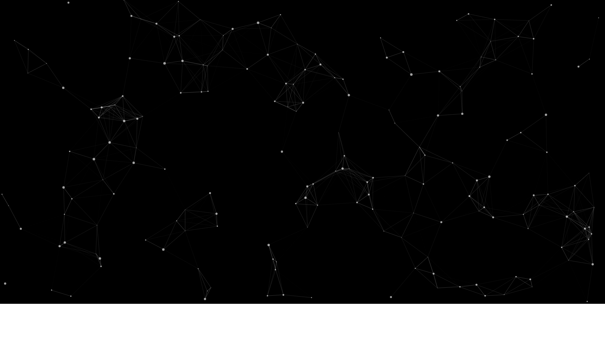

# x-particles-vue [](https://www.npmjs.com/package/x-particles) [](https://www.npmjs.com/package/x-particles)

> A Vue.js particles plugin base on [particles.js](https://github.com/VincentGarreau/particles.js) .

## Example

``` bash
# install dependencies
npm install

# serve with hot reload at localhost:8080
npm run dev
```

## Usage

``` bash
## Packages install
npm install x-particles --save

## main.js
import XParticles from 'x-particles'

Vue.use(XParticles)

## App.vue
<style lang="less">

</style>

<template>
  <div id="app" class="layout">
    <x-particles id="myParticles" :config="config"></x-particles>
  </div>
</template>

<script>
  export default {
    name: 'app',
    data () {
      return {
        config: {}
      }
    }
  }
<script>
```

## Preview

